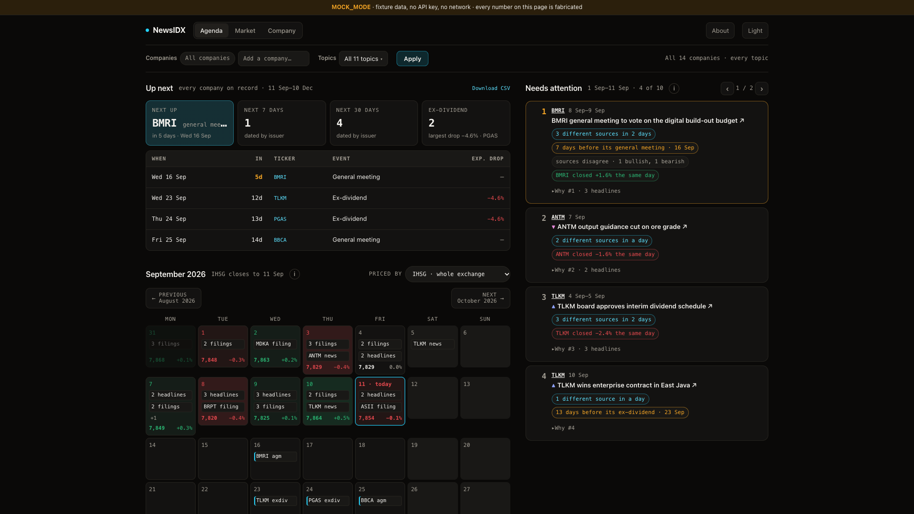
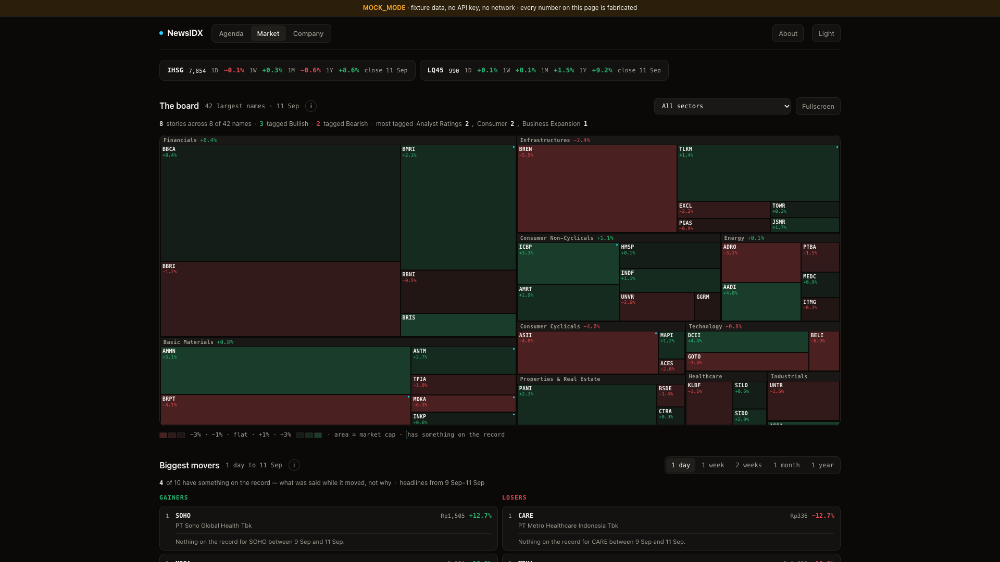
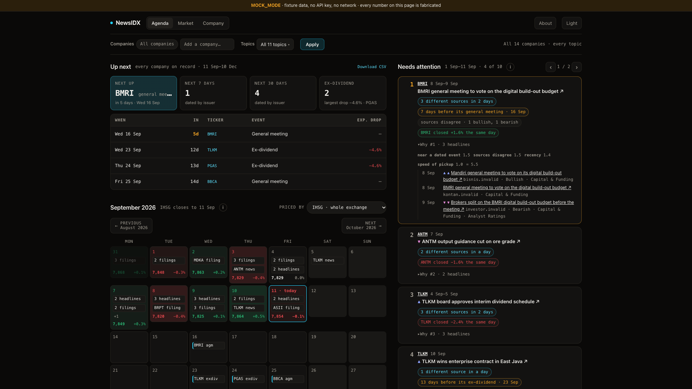
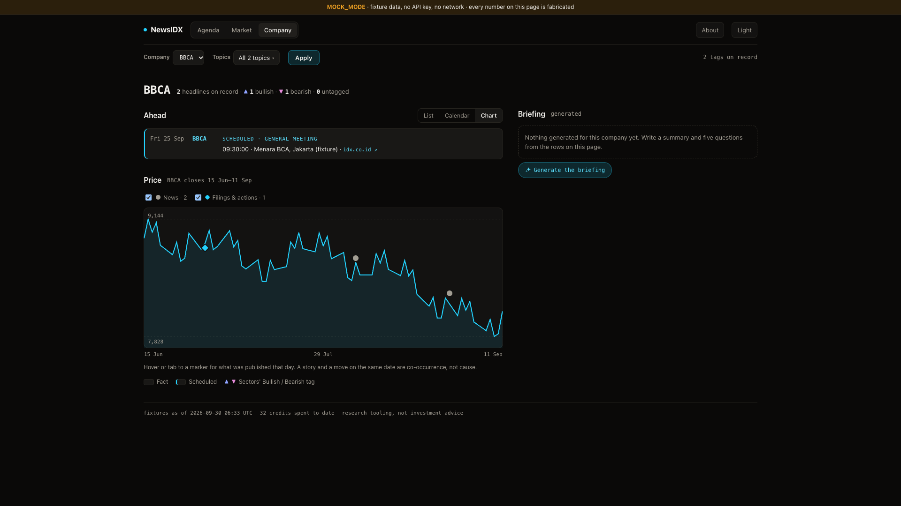
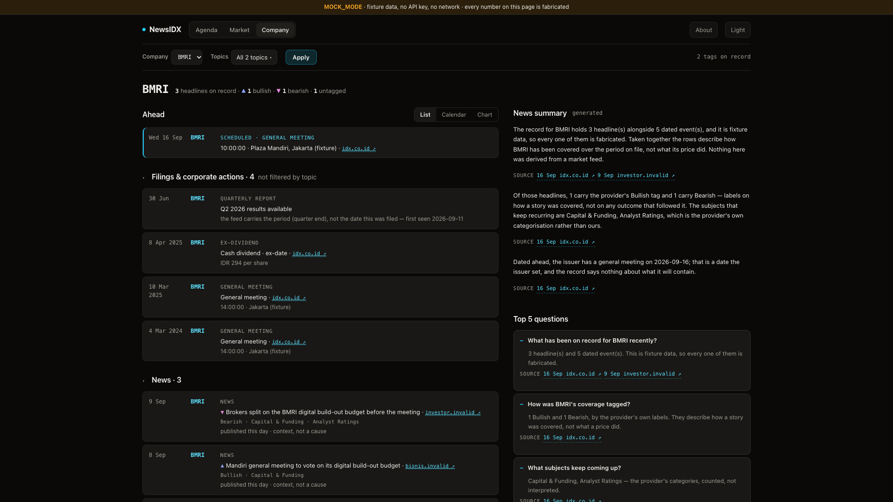
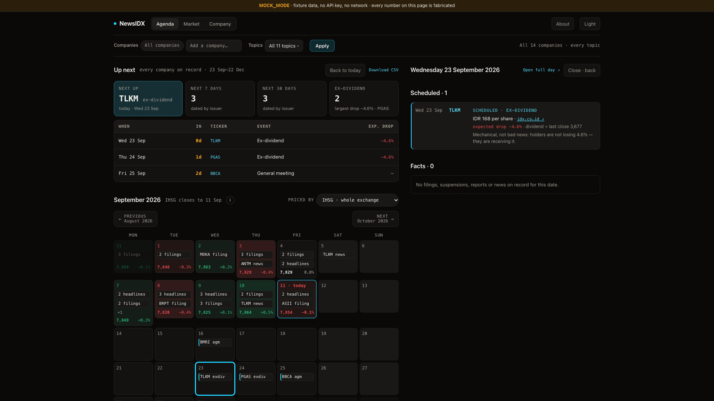
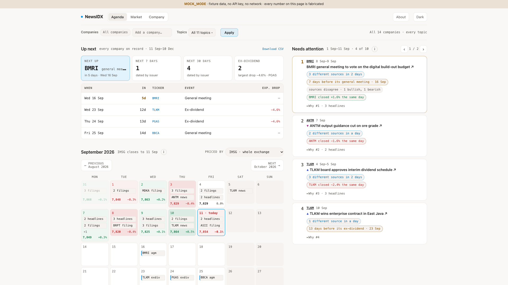

<!-- Classification: PUBLIC -->
# NewsIDX

In fast-moving markets, timing is everything. 
The retail investors usually notice the dividends, earnings, and corporate actions after the price has already reacted. 

**NewsIDX** is a **news-driven market dashboard for the Indonesian Stock Exchange (IDX)** designed to close that information gap. 
By centralizing corporate actions, earnings schedules, and breaking market sentiment into a single structured timeline, 
NewsIDX gives you a proactive view of the market before the charts move.
It is powered by two things:

* **Sectors API** for the market data: prices, dividends, meetings, earnings and news.
* **Claude** for the writing: a short summary of each company's news, a list of common
  questions and answers, a box where you can ask your own question, and a briefing.

<p align="center">
  
</p>

> All screenshots come from the demo version, which uses **sample data**. The numbers are not
> real, and every page shows a banner to remind you.

---

## What you can do with it

| Your question | Where NewsIDX answers it |
|---|---|
| What is coming up for my stocks? | **Up next**: the next event, how many events are in the next 7 and 30 days, and one table of everything in the next 90 days |
| How much will a dividend pull the price down? | **Ex-dividend drop**: the dividend divided by the last price. Both numbers are shown, so you can check it yourself |
| Are too many events in the same week? | **Cluster warning**: for example, *"three of your eight stocks have events in the week of 21 Sep"* |
| What is the news saying about my stocks? | **Needs attention**: if four news sites carry the same press release, you see it once. Stories are ranked by how much more coverage a company gets than usual |
| Is there news just before a known event? | **Event collision**: for example, *"3 sources in 2 days, 7 days before its general meeting"* |
| How did the whole market do? | **The board**: a heatmap of the 200 biggest companies by sector, plus the biggest winners and losers from one day up to one year |
| What is the full story on one company? | **Company page**: its events, a price chart with news and filings marked on it, and a Claude-written summary, Q&A and briefing |

**Can I trust the dates?** Yes. Every future date comes from the company itself. NewsIDX does not
guess or predict anything. Confirmed facts and planned dates look different on the page (different
shapes, not just different colours), and every fact links to its official source. News is shown
as background, never as the reason a price moved.

**Your watchlist is saved in the link** (`?w=BBCA,BBRI,TLKM`). There is no account and no login.
Just bookmark the page or share the link with a friend. You can add any day to Google Calendar,
and you can download **Up next** as a CSV file.

---

## Screenshots

<table>
  <tr>
    <td width="50%"><br><b>The board.</b> The 200 biggest IDX companies by sector. Box size is company value, colour is the last day's move.</td>
    <td width="50%"><br><b>Every ranking explains itself.</b> Click <i>Why</i> to see how a story got its score.</td>
  </tr>
  <tr>
    <td width="50%"><br><b>News and filings on the price chart.</b> Hover over a marker to see the source.</td>
    <td width="50%"><br><b>Briefing when you ask for it.</b> Claude only writes when you click, and every sentence links to a source we have saved.</td>
  </tr>
  <tr>
    <td width="50%"><br><b>Click any date</b> and Up next counts forward from that day.</td>
    <td width="50%"><br><b>Dark and light themes.</b> No outside trackers and no web fonts.</td>
  </tr>
</table>

It works on a phone too: see the [agenda](showcase/images/23-mobile-agenda.png),
[market](showcase/images/24-mobile-market.png) and [company](showcase/images/25-mobile-company.png)
pages. All 30 screenshots are in [`showcase/images`](showcase/images).

---

## Run it yourself

```bash
git clone https://github.com/nanto88/NewsIDX.git
cd NewsIDX
npm install
npm run demo          # builds the database from sample data
npm run demo:serve    # then open http://localhost:3000
```

The demo needs no API key, no internet and no sign-up. It sends the sample data through the same
code that the live version uses.

**To use real data:** copy `.env.example` to `.env` and add your `SECTORS_API_KEY`. Add
`ANTHROPIC_API_KEY` too if you want the Claude summary, Q&A and briefing. Then run
`npm run backfill` and `npm run serve`.

| Command | What it does |
|---|---|
| `npm test` | Builds the project and runs all tests. No key or internet needed |
| `npm run demo` / `demo:serve` | Builds and serves the sample database |
| `npm run probes` | Checks how the Sectors API behaves (uses about 12 credits) |
| `npm run backfill` | Loads 90 days of market data, plus extra data for your watchlist |
| `npm run serve` | Serves the live database on `PORT` (default 3000) |

### How it works

Node 20+, TypeScript, Fastify and SQLite (`better-sqlite3`). The server builds plain HTML pages.
There is no bundler and no frontend framework.

```
Sectors API -> api.ts (credit limit, saved cache) -> backfill.ts
  -> SQLite -> calendar.ts / attention.ts (page data) -> render.ts / server.ts
                                Claude -> faq.ts (summary, Q&A, briefing)
```

Three simple rules keep it honest:

* **Only raw data is saved.** The database keeps exactly what the API sent back. Every percentage
  and ranking is worked out fresh when a page loads.
* **Claude writes, but never decides.** Claude only puts our saved news and facts into plain
  words. It never makes up a number, and it can only link to sources we already have.
* **API credits have a limit.** Every call is checked against a hard limit, and each run records
  how many credits it used.

### Learn more

* [`docs/DETAILS.md`](docs/DETAILS.md): the full guide to settings, credits, how dates are
  trusted, and every part of the UI.
* [`METHODOLOGY.md`](METHODOLOGY.md): how each number is calculated, and what it does not mean.
* [`plan.md`](plan.md): the original build plan, including the ideas we dropped.

---

## Disclaimer

**NewsIDX is a personal research tool. It is not investment advice.** Nothing here tells you to
buy, sell or hold any stock. In demo mode every number is made up. Always check anything important
against the company's own filing before you act.
